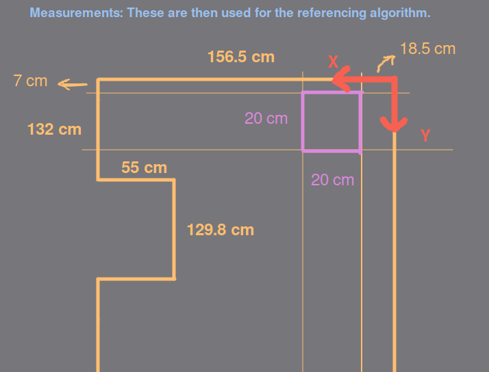

### Detección de objetos + Referenciarlo en el plano del piso + Tracking.
1. Coloco una webcam en altura elevada, simulando una cámara de vigilancia.
2. Coloco un cuadrado en el piso con cinta de papel, me servirá luego para determinar los puntos de referencia.
3. Armé un script para registrar el video de la webcam en tiempo real, y con la letra `c` se obtiene una captura de la imagen.
4. Usando `label-studio` genero los puntos de referencia y la posición de las patas delanteras de los gatos.
5. Levanto las imágenes y los labels, `points_ref` y `points_real` calculo la matriz de homografía usando `cv2.findHomography`.
6. Luego la utilizo para proyectar cualquier punto desde la imagen al plano real (por ejemplo, las patas del gato) usando `cv2.perspectiveTransform`.
7. Finalmente exporto los resultados en `/data/projected`.

### Demo
- Stremear la webcam, si se da click en la imagen, guardar el frame en ese momento y en la posición donde se dió el click debe aparecer un punto rojo, y quizas un archivo csv para guardar nombre de la imagen, y posicion donde se dio el click. Para una demo.

<br>


### label-studio
```bash
# Para arrancar el servidor y labelear en http://localhost:8080.
label-studio start
```

### Ideas
- A cada frame clasificar desde que ángulo se toma la imagen (frente, izquierda, derecha, atrás, etc..)
- Pose detection, y key_points.
- Obtener altura del objeto.
- Keypoints, y sacar pose, ver si puedo sacar la manos y el cuerpo en la batería.

### Ver que pasa si:
- Los pies son tapados en la imagen.
- Solo se ve el torso.
- La persona salta.
