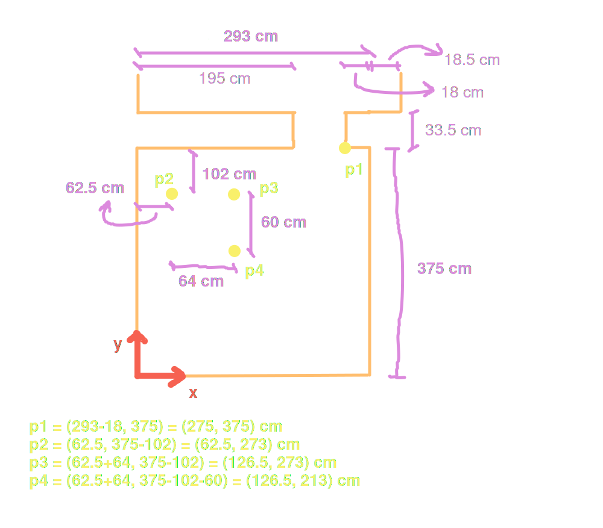

<br>


### label-studio
```bash
# Para arrancar el servidor y labelear en http://localhost:8080.
label-studio start
```

### Demo
- Stremear la webcam, si se da click en la imagen, guardar el frame en ese momento y en la posición donde se dió el click debe aparecer un punto rojo, y quizas un archivo csv para guardar nombre de la imagen, y posicion donde se dio el click. Para una demo.

### Ideas
- Detector de changuitos, si es que no están trackeados con algún dispositivo.


### Ver que pasa si:
- Los pies son tapados en la imagen.
- Solo se ve el torso.
- La persona salta.
